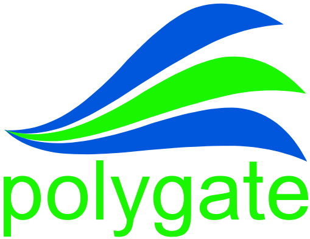

	

	
	
	
	

------------------

### What is?

Polygate is a gRPC hub to aid the service mesh development providing the following features:

* Event sourcing from logs (as base64 encoded protobufs)
* Fire and forget messaging pattern (using gRPC client streaming)
* gRPC calls throttling, configuration hot reload
* Designed to be stateless so it's easy to scale it
* Distributed tracing and failure reporting through logs
* Request/response metadata support
* Prometheus metrics endpoint (and liveness/readiness endpoints to Kubernetes)
* Easy to scale with standalone Redis or Redis Sentinel (uses client partitioning algorithm)

### What problems does Polygate solve?

The idea behind Polygate project is to enable asynchronous communication between microservices without dealing with asynchronous issues/requirements on each implementation. It solves many problems like monitoring, tracing, event sourcing, throttling, scalability and performance. Reading this documentation you'll learn more about Polygate and the primitives adopted to solve many issues of distributed computing environments.

There're two projects on roadmap to enhance Polygate's utilities: Apparatus and Seeder. Apparatus is a mode which Polygate can operate to serve many useful utilities to address common distributed computing issues like distributed locks, scheduling and etc. Seeder is another mode to provide an easy way to rebuild your upstream states by replaying events history.